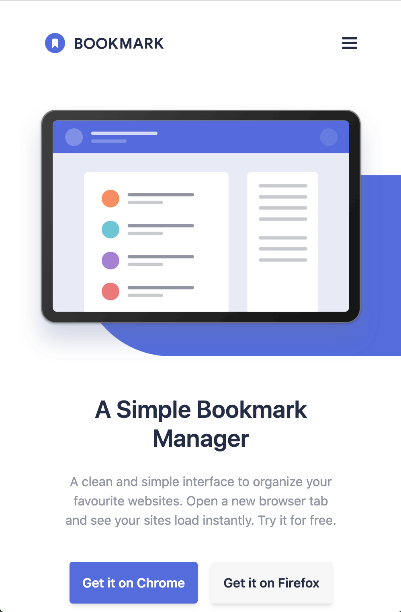
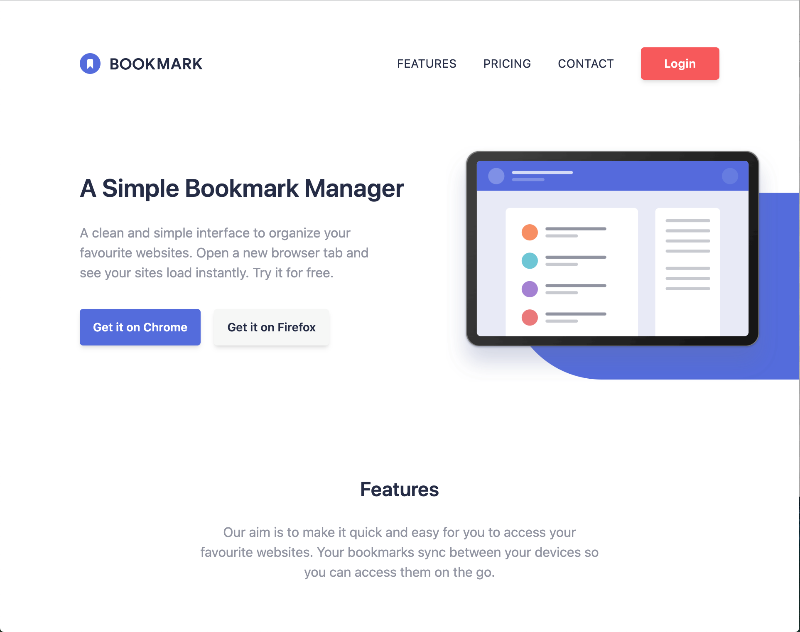
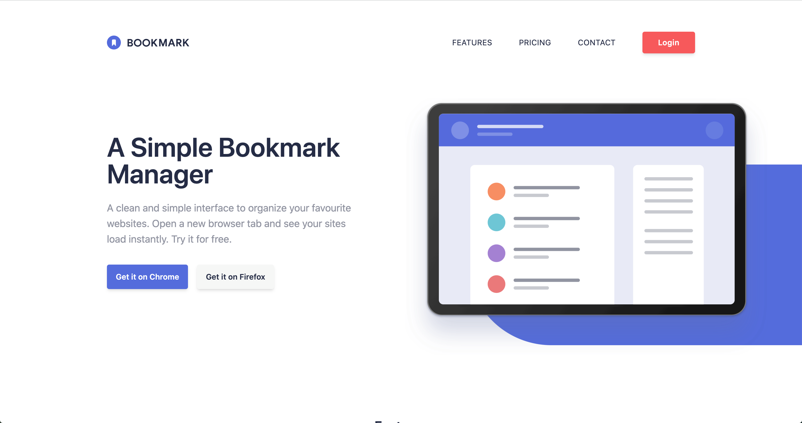

# Frontend Mentor - Bookmark landing page solution

This is a solution to the [Bookmark landing page challenge on Frontend Mentor](https://www.frontendmentor.io/challenges/bookmark-landing-page-5d0b588a9edda32581d29158). Frontend Mentor challenges help you improve your coding skills by building realistic projects. 

## Table of contents

- [Overview](#overview)
  - [The challenge](#the-challenge)
  - [Screenshot](#screenshot)
  - [Links](#links)
- [My process](#my-process)
  - [Built with](#built-with)
  - [What I learned](#what-i-learned)
  - [Continued development](#continued-development)
  - [Useful resources](#useful-resources)
- [Author](#author)
- [Acknowledgments](#acknowledgments)

## Overview

### The challenge

Users should be able to:

- View the optimal layout for the site depending on their device's screen size
- See hover states for all interactive elements on the page
- Receive an error message when the newsletter form is submitted if:
  - The input field is empty
  - The email address is not formatted correctly

### Screenshot

<p>Mobile</p>


<p>Tablet</p>


<p>Desktop</p>


<p>I designed three different layouts for this challenge - mobile, tablet and desktop. I went for a mobile-first workflow, and then extended out from there.<p>

### Links

- Solution URL: [](https://your-solution-url.com)
- Live Site URL: [Netlify URL](https://frontend-mentor-bookmark-manager.netlify.app/)

[](https://app.netlify.com/sites/frontend-mentor-bookmark-manager/deploys)

## My process

### Built with

- [React](https://reactjs.org/) - JS library
- [Next.js](https://nextjs.org/) - React framework
- [Tailwind CSS](https://tailwindcss.com/) - For styles
- Mobile-first workflow
- Flexbox
- CSS Grid

### What I learned

I learned a lot throughout the development of this project. I realised the importance of mobile-first workflows, and found that Tailwind CSS was helpful with enforcing this. It's functionality and the way it's workflow is designed, forces you to start with a mobile layout, and then expand using the medium and large viewport breakpoints. It was also incredibly helpful at speeding up the styling process, and worked efficiently alongside React. The ability to write HTML, CSS and JavaScript all within the same file, while keeping it looking clean and concise, creates a professional development environment and dramatically speeds up the workflow.

Here is an snippet of code from this project which shows how React, alongside Tailwind CSS, allows for a clean and concise layout:

```js
 <div className="relative">
            <form className="mt-6 md:flex md:gap-4 md:justify-center" onSubmit={handleSubmit} noValidate>
                <div className={`relative ${emailError ? 'bg-primary-red border-primary-red border-t-4 border-x-4 mb-4' : 'mb-5'} rounded`}>
                    <input
                        className="rounded w-full h-[45px] p-6 shadow-none outline-none md:w-[300px] md:py-4 md:px-12 md:placeholder:-p-1"
                        type="email"
                        name="email"
                        placeholder="john@smith.com"
                        pattern="[a-z0-9._%+-]+@[a-z0-9.-]+\.[a-z]{2,4}$"
                        required
                        value={email}
                        onChange={handleEmailChange}
                    />
                    <div className={`p-2 bg-primary-red text-white text-xs italic font-semibold transition-all duration-500 ${emailError ? '' : 'hidden'}`}>
                        <div>
                            Whoops, make sure it's an email
                        </div>
                        <ErrorIcon className={`absolute right-3 top-1/2 transform -translate-y-[1.6rem]`} />
                    </div>
                </div>
                <Button className="bg-primary-red text-white w-full shadow-none md:py-3 md:text-sm active:ring-primary-red active:ring-2 active:text-primary-red" label={'Contact Us'} />
            </form>
        </div>
```

### Continued development

I would like to become more comfortable with using React Hooks, such as useState, useEffect, useContext and so on. This was a much more layout-orientated project, rather than a functional application, so I only needed to use the useState hook. But as my development progresses, I would like to be able to efficiently use React's more advanced functions to create rich and dynamic web applications.

### Useful resources

- [Tailwind CSS Documentation](https://tailwindcss.com/docs/installation) - The Tailwind documentation helped me out massively. I used it throughout the development of this project.

## Author

- Frontend Mentor - [@alfiemitchell123](https://www.frontendmentor.io/profile/alfiemitchell123)

## Acknowledgments

- [Karishma Garg's Solution](https://www.frontendmentor.io/solutions/bookmark-landing-page-lpjJDXaPf) - This Frontend Mentor solution helped me when I was struggling with the layout of the blue shape in the hero and features sections.
